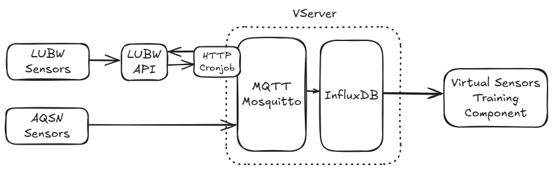

# Air Quality Sensor Network - Virtual Sensors (AQSN-VS)

This repository is part of the "AirUP!". A project by the University of Applied Science Heilbronn (https://www.hs-heilbronn.de/de/airup-messnetz)
"AirUP!" is analysing air quality by utilising low cost sensor for higher spatial resolution. 
The low cost sensors detect air pollutions like NO2 over the voltage difference of two electrons but lack 
in precision in mapping these voltage differences to the real world pollution volumes. 

To overcome this problem the project also gets data from two high cost air quality sensor of the "Landesamt für Umwelt Baden Württemberg"
(LUBW/DEBW). These high quality sensors are calibrated in a standardized laboratory environment and use several complex methods 
for air quality measurement. 

Because ot the high cross-sensitivity when it comes to air quality measurements, these calibrations results e.g. the calibration factor can 
not be simple be used for the low costs sensors. To overcome this issue, this projects aims to use machine learning methods to find the correct relation
between the measurements of the low cost sensor of AQSN and results of the high quality sensor of LUBW/DEBW. BY finding these patterns and save them in 
a "virtual sensor" software component, the AQSN sensor can the used for efficient, low cost air quality measures with the high reliability on a broad area.

The results of these sensor networks can further be used for data-driven decisions in air improvement, climate change adjustments and public transport.

## Architecture
The data of the LUBW sensors is requests by a cronjob script. Data of AQSN sensors by a MQTT Client. 
To gather and store the data of the different sensor, AQSN-VS uses Mosquitto Message Broker and InfluxDB. 
All components are deployed on a VServer hostet by cloud provider. 

